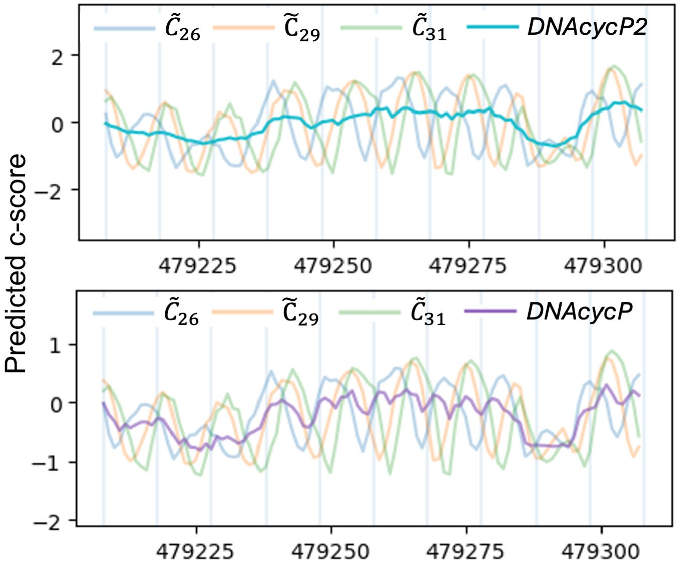
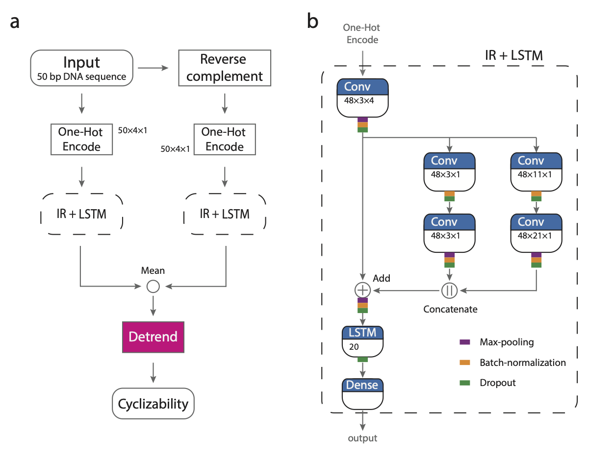

DNAcycP2 Python package 
================

**Maintainer**: Ji-Ping Wang, \<<jzwang@northwestern.edu>\>; Brody Kendall \<<curtiskendall2025@u.northwestern.edu>\>; Keren Li, \<<keren.li@northwestern.edu>\>

**License**: GPLv3

**Cite DNAcycP2 package**:

Kendall, B., Jin, C., Li, K., Ruan, F., Wang, X.A., Wang, J.-P., DNAcycP2: improved estimation of intrinsic DNA cyclizability through data augmentation, 2025

## What is DNAcycP2?

**DNAcycP2**, short for **DNA** **cyc**lizability **P**rediction v**2**, is a Python package (R version is also available) developed for precise and unbiased prediction of DNA intrinsic cyclizability scores. This tool builds on a deep learning framework that integrates Inception and Residual network architectures with an LSTM layer, providing a robust and accurate prediction mechanism.

DNAcycP2 is an updated version of the earlier **DNAcycP** tool released by Li et al. in 2021. While DNAcycP was trained on loop-seq data from Basu et al. (2021), DNAcycP2 improves upon it by training on smoothed predictions derived from this dataset. The predicted score, termed **C-score**, exhibits high accuracy when compared with experimentally measured cyclizability scores obtained from the loop-seq assay. This makes DNAcycP2 a valuable tool for researchers studying DNA mechanics and structure.

## Key differences between DNAcycP2 and DNAcycP

Following the release of DNAcycP, it was found that the intrinsic cyclizability scores derived from Basu et al. (2021) retained residual bias from the biotin effect, resulting in inaccuracies (Kendall et al., 2025). To address this, we employed a data augmentation + moving average smoothing method to produce unbiased estimates of intrinsic DNA cyclizability for each sequence in the original training dataset. A new model, trained on this corrected data but using the same architecture as DNAcycP, was developed, resulting in DNAcycP2. This version also introduces improved computational efficiency through parallelization options. Further details are available in Kendall et al. (2025).

To demonstrate the differences, we compared predictions from DNAcycP and DNAcycP2 in a yeast genomic region at base-pair resolution (Figure 1). The predicted biotin-dependent scores ($\tilde C_{26}$, $\tilde C_{29}$, and $ \tilde C_{31}$, model trained separately) show 10-bp periodic oscillations due to biotin biases, each with distinct phases. DNAcycP's predictions improved over the biotin-dependent scores, while still show substantial
local fluctuations likely caused by residual bias in the training data (the called intrinsic cyclizability score $\hat C_0$ from Basu et al. 2021). In contrast, DNAcycP2, trained on corrected intrinsic cyclizability scores, produces much smoother local-scale predictions, indicating a further improvement in removing the biotin bias.

The DNAcycP2 package retains all prediction functions from the original DNAcycP. The improved prediction model, based on smoothed data, can be accessed using the argument smooth=TRUE in the main function (see usage below).


## Available formats of DNAcycP2 and DNAcycP

DNAcycP2 is available in three formats: A web server available at http://DNAcycP.stats.northwestern.edu for real-time prediction and visualization of C-score up to 20K bp, a standalone Python package avilable for free download from https://github.com/jipingw/DNAcycP2-Python, and a new R package available for free download from bioconductor (https://github.com/jipingw/DNAcycP2). DNAcycP2 R package is a wrapper of its Python version, both generate the same prediction results.

DNAcycP Python package is still available for free download from https://github.com/jipingw/DNAcycP.
As DNAcycP2 include all functionalities of DNAcycP, users can generate all DNAcycP results using DNAcycP2.

## Architecture of DNAcycP2

The core of DNAcycP2 is a deep learning architecture mixed with an Inception-ResNet structure and an LSTM layer (IR+LSTM, Fig 2) that processes the sequence and its reverse complement separately, the results from which are averaged and detrended to reach the predicted intrinsic score. 



## DNAcycP2 required packages

*The recommended python version is 3.11*

* `numpy==1.26.1`
* `pandas==2.1.2`
* `tensorflow==2.14.0`
* `keras==2.14.0`
* `bio==1.7.1`
* `docopt==0.6.2`


## Installation

**DNAcycP2** Python package requires specific versions of dependencies. We recommend to install and run **DNAcycP2** in a virtual environment. For example, suppose the downloaded DNAcycP2 package is unpacked as a folder `dnacycp2-main`. We can install DNAcycP2 in a virtual environment as below:

```bash
cd dnacycp2-main
python3 -m venv env
source env/bin/activate test
pip install -e .
```

Run `dnacycp2-cli ` to see whether it is installed properly.

*Note: You may need to deactivate then re-activate the virtual environment prior to this step (see below)*

```bash
dnacycp2-cli 
```

Once done with DNAcycP2 for prediction, you can close the virtual environment by using:
```bash
deactivate
```

Once the virtual environment is deactivated, you need to re-activate it before you run another session of prediction as follows:
```bash
cd dnacycp2-main
source env/bin/activate test
```

## Usage

### Main Function

DNAcycP2 supports the input sequence in two formats: FASTA format (with sequence name line beginning with “>”) or plain TXT format. Unlike in the web server version where only one sequence is allowed in input for prediction, the Python package allows multiple sequences in the same input file. In particular for the TXT format, each line (can be of different length) in the file is regarded as one input sequence for prediction, however the computation is significantly more efficient when every sequence has length exactly 50bp. 

The main function in DNAcycP2 is `dnacycp2-cli`, which is called through one of the following lines:
```bash
dnacycp2-cli -f -s <inputfile> <basename> [-L <chunk_length>] [-n <num_cores>]
dnacycp2-cli -f <inputfile> <basename> [-L <chunk_length>] [-n <num_cores>]
dnacycp2-cli -t -s <inputfile> <basename>
dnacycp2-cli -t <inputfile> <basename>
```

where 
  * `-f/-t`: indicates the input file name in FASTA or TXT format respectively; either one must be specified.
  * `-s`: (optional) indicates the updated model trained on smoothed data (**DNAcycP2**) should be used. **If `-s` is omitted, the model trained on the original, biased data (DNAcycP) will be used**.
  * `<inputfile>`: is the name of the intput file;
  * `<basename>`: is the name base for the output file.
  * `-L <chunk_length>`: is the length of sequence that a given core will be predicting on at any given time (default 100000; only applicable with `-f`)
  * `-n <num_cores>`: is the number of cores to be used in parallel (default 1 - no parallelization; only applicable with `-f`)

### Selecting the Prediction Model

Use the `-s` argument to specify the prediction model:

- **`-s`**: DNAcycP2 (trained on smoothed data, recommended).
- **Otherwise**: DNAcycP (trained on original data).

### Parallelization with `-f`

The `-f` setting (FASTA format) is designed for handling larger files and supports parallelization. To enable parallelization, use the following arguments:

- **`-n`**: Number of cores to use (default: 1).
- **`-L`**: Sequence length (in bp) each core processes at a time (default: 100,000).

For reference, on a personal computer (16 Gb RAM, M1 chip with 8-core CPU), prediction at full parallelization directly on the yeast genome FASTA file completes in 12 minutes, and on the hg38 human genome Chromosome I FASTA file in just over 4 hours. In our experience, selection of parallelization parameters (`-L` and `-n`) has little affect when making predictions on a personal computer, but if using the package on a high-performance compute cluster, prediction time should decrease as the number of cores increases. If you do run into memory issues, we suggest first reducing `-L`.

### Example 1:

```bash
dnacycp2-cli -f -s ./data/raw/ex1.fasta ./data/raw/ex1_smooth -L 1000 -n 2
dnacycp2-cli -f ./data/raw/ex1.fasta ./data/raw/ex1_original -L 1000 -n 2
```

The `-f` option specifies that the input file named "ex1.fasta" is in fasta format. 

The `-s` option specifies that the DNAcycP2 model should be used for prediction, while omitting the `-s` argument specifies that the original DNAcycP model should be used for prediction.

The `-L` option specifies that prediction will occur on sequences of length 1000 for a given core

The `-n` option specifies that prediction will occur on 2 cores in parallel

The `./data/raw/ex1.fasta` is the sequence file path and name, and `./data/raw/ex1` specifies the output file will be saved in the directory `./data/raw` with file name initialized with `ex1`.
For example, `ex1.fasta` contains two sequences with IDs "1" and "2" respectively.
The output files containing DNAcycP2 predictions will be named as "ex1_smooth_cycle_1.txt" and "ex1_smooth_cycle_2.txt" for the first and second sequences respectively, while the output files containing DNAcycP predictions will be named as "ex1_original_cycle_1.txt" and "ex1_original_cycle_2.txt".

Each output file contains three columns. The first columns is always `position`. When `-s` is specified, the next columns are `C0S_norm`, `C0S_unnorm`, and when `-s` is not specified, the next columns are `C0_norm` and `C0_unnorm`. The predicted C-score for either model is the normalized output (`C0S_norm` and `C0_norm`), the predictions from the model trained based on the standardized loop-seq score (in the case of DNAcycP) or the standardized smoothed intrinsic cyclizability estimate (in the case of DNAcycP2) of the Tiling library of Basu et al 2021 (i.e. 0 mean unit variance). When predictions are made using the original DNAcycP, the `C0_unnorm` is the predicted C-score recovered to the original scale of loop-seq score in the Tiling library data from Basu et el 2021. When predictions are made using the updated DNAcycP2 (`-s`), the `C0S_unnorm` is the predicted C-score recovered to the scale of standardized raw cyclizability scores of the Tiling library data. The standardized scores provide two advantages. As loop-seq may be subject to a library-specific constant, standardized C-score is defined with a unified baseline as yeast genome (i.e. 0 mean in yeast genome). Secondly, the C-score provides statisitcal significance indicator, i.e. a C-score of 1.96 indicates 97.5% in the distribution.


### Example 2:

```bash
dnacycp2-cli -t -s ./data/raw/ex2.txt ./data/raw/ex2_smooth
dnacycp2-cli -t ./data/raw/ex2.txt ./data/raw/ex2_original
```
With `-t` option, the input file is regarded as in TXT format, each line representing a sequence without sequence name line that begins with ">".

The `-s` option again specifies that the DNAcycP2 model should be used for prediction, while omitting the `-s` argument specifies that the original DNAcycP model should be used for prediction.

The predicted C-scores will be saved into two files, one with `_C0S_unnorm.txt` and the other with `_C0S_norm.txt` in the DNAcycP2 (`-s`) case, or `_C0_unnorm.txt` and `_C0_norm.txt` in the DNAcycP case. C-scores in each line correspond to the sequence in the input file in the same order.

For any input sequence, DNAcycP2 predicts the C-score for every 50 bp. Regardless of the input sequence format the first C-score in the output file corresponds to the sequence from position 1-50, second for 2-51 and so forth.


### Example 3 (Single Sequence):

If you want the predict C-scores for a single sequence, you can follow the same protocol as Example 1 or 2, depending on the input format. We have included two example files representing the same 1000bp stretch of S. Cerevisiae sacCer3 Chromosome I (1:1000) in .fasta and .txt format.

First, we will consider the .fasta format:

```bash
dnacycp2-cli -f -s ./data/raw/ex3_single_seq.fasta ./data/raw/ex3_fasta_smooth
dnacycp2-cli -f ./data/raw/ex3_single_seq.fasta ./data/raw/ex3_fasta_original
```

The output file containing DNAcycP2 predictions will be named as "ex3_fasta_smooth_cycle_1.txt" and the output file containing DNAcycP predictions will be named as "ex3_fasta_original_cycle_1.txt".

We can examine these files, respectively, using the following commands:

```bash
less data/raw/ex3_fasta_smooth_cycle_1.txt
less data/raw/ex3_fasta_original_cycle_1.txt
```

(Press 'q' to close the file)

In each of these, we can scroll through the predictions to find any specific areas of interest where the first column will be the position in the sequence (for example, row 1/position 25 corresponds to base pairs 1-50 of the sequence), the second column will be the normalized C-score, and the third column will be the unnormalized C-score.

Next, we will consider the .txt format:

```bash
dnacycp2-cli -t -s ./data/raw/ex3_single_seq.txt ./data/raw/ex3_txt_smooth
dnacycp2-cli -t ./data/raw/ex3_single_seq.txt ./data/raw/ex3_txt_original
```

The predicted C-scores will be saved into two files for each command (four total), we can examine them with the following commands:


```bash
less data/raw/ex3_txt_smooth_C0S_norm.txt
less data/raw/ex3_txt_smooth_C0S_unnorm.txt
less data/raw/ex3_txt_original_C0_norm.txt
less data/raw/ex3_txt_original_C0_unnorm.txt
```

(Press 'q' to close the file)

In each of these, we can scan through the predictions to find specific areas of interest. If, for example, we want to print the smooth (DNAcycP2) normalized predictions for only the first 100 bp of the sequence (corresponding to subsequences defined by positions [1,50], [2,51], ..., and [51-100]), we can use the following command:

```bash
cut -d ' ' -f 1-51 data/raw/ex3_txt_smooth_C0S_norm.txt
```

For each of these examples, the output files are also written to your local computer, so you can view/interact with them using whichever software you are comfortable with (e.g. Rstudio, VSCode, Notepad, etc.)

### Run prediction within Python interactive session

```python
from dnacycp2 import cycle_fasta, cycle_txt

# Smooth prediction using DNAcycP2:
cycle_fasta("data/raw/ex1.fasta","ex1_smooth", smooth=True, chunk_size=1000, num_threads=2)
cycle_txt("data/raw/ex2.txt","ex2_smooth",smooth=True)

# Original prediction using DNAcycP:
cycle_fasta("data/raw/ex1.fasta","ex1_original",smooth=False, chunk_size=1000, num_threads=2)
cycle_txt("data/raw/ex2.txt","ex2_original",smooth=False)
```


## Other References

* Li, K., Carroll, M., Vafabakhsh, R., Wang, X.A. and Wang, J.-P., DNAcycP: A Deep Learning Tool for DNA Cyclizability Prediction, *Nucleic Acids Research*, 2021

* Basu, A., Bobrovnikov, D.G., Qureshi, Z., Kayikcioglu, T., Ngo, T.T.M., Ranjan, A., Eustermann, S., Cieza, B., Morgan, M.T., Hejna, M. et al. (2021) Measuring DNA mechanics on the genome scale. Nature, 589, 462-467.


